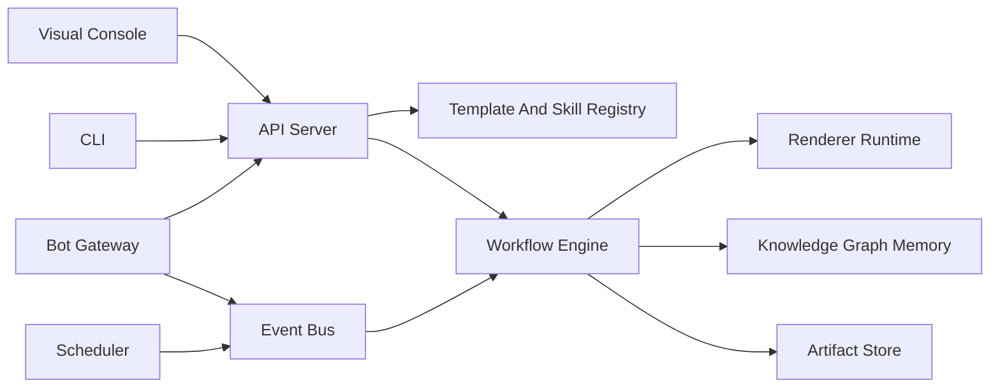
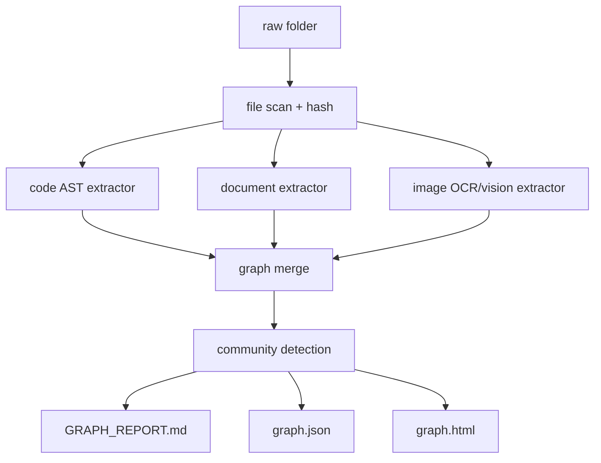

# Skills Workflow Platform Product And Architecture Plan

Last updated: 2026-05-15

## 1. Executive Summary

This document defines the next version of Skills Platform: a reusable workflow and content automation system. The goal is to make daily reports, wallpaper posts, WeChat articles, H5 pages, image exports, bot conversations, scheduled jobs, and knowledge-base workflows share one programmable foundation.

The current project already has useful pieces:

- `src/workflows`: YAML workflow parsing and execution.
- `src/reports/daily_renderer.py`: daily report rendering.
- `src/reports/wechat_renderer.py`: WeChat-style article rendering and image export.
- `src/core/models.py`: v2 Pydantic models for skills, workflows, triggers, daily logs.

The next step is not to add more one-off renderers. The system should move to:

- Fieldized templates: templates declare editable fields, slots, assets, outputs, and validation.
- Template registry: daily reports, wallpaper posts, WeChat articles, and future formats are installed as template packages.
- Workflow orchestration: any template render, file ingest, bot event, or knowledge graph update is a workflow node.
- Bot gateway: Feishu, DingTalk, generic webhook, and WebSocket agents use one event protocol.
- Skill app registry: each external integration has an app id, secret, scopes, hooks, and generated SDK binding.
- Knowledge graph memory: a raw folder can be indexed into a queryable graph that agents use before reading files blindly.

The product should be local-first at MVP stage, API-first at platform stage.

## 2. Requirement Review

### 2.1 User Goals

The user wants workflows to become simpler, more general, and easier to control:

- Replace hardcoded renderer arguments with fieldized, programmable template definitions.
- Support flexible content replacement for daily reports, wallpaper posts, and WeChat public-account content.
- Make templates manageable through CLI and visual UI.
- Enable workflow orchestration, event triggers, scheduled jobs, hooks, heartbeat, and feedback.
- Provide standard bot integration over webhook and WebSocket, similar to Feishu and DingTalk bots.
- Provide a standard skill app creation process with app id, secret, scopes, and SDK generation.
- Let agents learn skills and bind generated SDKs into the system.
- Add memory and knowledge-base capability: drop files into a folder and grow a knowledge graph.

### 2.2 Product Scope

In scope:

- Template schema and template registry.
- Content and asset model.
- Renderer plugin interface.
- Visual template editor.
- Workflow orchestration around templates, files, bots, and knowledge graph jobs.
- Generic bot gateway with webhook and WebSocket transports.
- App credential and permission model.
- Event bus, hooks, heartbeat, task feedback, and scheduler.
- Knowledge graph ingestion pipeline and agent memory rules.

Out of scope for MVP:

- Full multi-tenant SaaS.
- Direct publishing to WeChat without platform constraints.
- Running arbitrary JavaScript inside WeChat article body.
- Distributed workflow engine.
- Enterprise-grade RBAC.

### 2.3 Key Constraint

WeChat public-account article body should be treated as static rich text. Dynamic interaction should be handled by:

- Copyboard helper page for local editing and rich-text copy.
- H5 or external article page for actual dynamic interaction.
- PNG/SVG image exports for stable public-account publishing.

## 3. Design Principles

1. Templates are data, not code.

Templates must declare fields, slots, default values, validations, output targets, and preview behavior. Python code should only implement reusable renderers.

2. Renderers are plugins.

Daily report, WeChat article, wallpaper gallery, and future formats should implement the same renderer interface.

3. Workflows operate on typed artifacts.

A workflow node should read and write typed artifacts such as `ArticleDraft`, `TemplateRender`, `ImageExport`, `KnowledgeGraph`, and `BotMessage`.

4. Bots speak one protocol.

Feishu, DingTalk, generic webhook, and local WebSocket agents should normalize events into the same internal envelope.

5. Agents require rules, not blind permissions.

Every agent action must carry app identity, scope, audit trace, correlation id, and optional human approval policy.

6. Knowledge graph is a navigation layer.

The graph helps agents find context, but facts still need source evidence and confidence tags.

## 4. Target Product Modules



### 4.1 Template Center

Responsible for:

- Template creation.
- Field definition.
- Theme management.
- Slot layout.
- Output mapping.
- Preview gallery.
- Versioning.

Initial template types:

- `daily.report`
- `wechat.article`
- `wallpaper.gallery`
- `image.poster`
- `h5.widget`

### 4.2 Visual Console

Main screens:

- Template gallery: list templates, themes, outputs, version, last render.
- Template editor: editable fields, asset slots, theme tokens, preview.
- Workflow builder: nodes, triggers, outputs, conditions.
- Bot app management: app id, secret, scopes, webhook URL, WebSocket endpoint.
- Run history: status, logs, artifacts, retry.
- Knowledge base: watched folders, graph status, query/path/explain.

MVP can be a local HTML/React app served by FastAPI, or a generated static admin page backed by JSON files.

### 4.3 Workflow Center

The current YAML engine should evolve into a typed workflow engine.

Core capabilities:

- Manual trigger.
- Scheduled trigger.
- Event trigger.
- Webhook trigger.
- File change trigger.
- Hook trigger.
- Retry and timeout.
- Node-level status.
- Artifact passing.
- Execution audit log.

### 4.4 Bot Gateway

Supported transports:

- HTTP webhook.
- WebSocket session.
- CLI local adapter.

Supported platform adapters:

- Generic webhook.
- Feishu bot.
- DingTalk bot.
- Local agent.

The gateway should convert platform-specific messages into one internal event envelope.

### 4.5 Skill App Registry

Each external integration or agent gets an app record:

- `app_id`
- `app_secret_hash`
- `name`
- `owner`
- `scopes`
- `allowed_events`
- `webhook_url`
- `websocket_enabled`
- `status`
- `created_at`
- `rotated_at`

Agents do not receive raw file access by default. They receive scoped actions exposed by skills and workflows.

### 4.6 Knowledge Graph Memory

Reference behavior can follow graphify-style workflow: scan folders, extract code structure locally, extract document/image semantics with model help, then write graph outputs. The public Graphify README describes outputs such as `graph.html`, `GRAPH_REPORT.md`, and `graph.json`, platform installs for Codex, and assistant hooks that tell the assistant to consult the graph before file search.

In this project, we should not couple directly to Graphify internals. Use an adapter boundary:

- `graphify` adapter: invoke external tool when installed.
- `native` adapter: project-owned minimal graph builder later.

The memory system should expose:

- `memory.ingest_folder`
- `memory.update`
- `memory.query`
- `memory.path`
- `memory.explain`
- `memory.report`

## 5. Standard Template Specification

### 5.1 Template Manifest

File path proposal:

```text
templates/<template_key>/template.yaml
templates/<template_key>/themes/<theme_key>.yaml
templates/<template_key>/views/*.html
templates/<template_key>/assets/
```

Example:

```yaml
id: wechat.wallpaper.gallery
name: WeChat Wallpaper Gallery
version: 1.0.0
type: wechat.article
renderer: wechat_gallery

fields:
  title:
    type: string
    label: Title
    required: true
    default: "SHARE壁纸|百看不厌的壁纸"
  publish_date:
    type: date
    label: Publish Date
    default: "{{ today }}"
  author:
    type: string
    label: Author
    default: "Skills Workflow"
  source_name:
    type: string
    label: Source Name
    default: "Skills Platform"
  source_statement:
    type: text
    label: Source Statement
  summary:
    type: text
    label: Summary

slots:
  gallery_images:
    type: image[]
    min_items: 1
    max_items: 30
  cta_image:
    type: image
    required: false

outputs:
  - id: preview_html
    format: html
    target: preview
  - id: wechat_copyboard
    format: html
    target: copyboard
  - id: article_header
    format: png
    size: [1242, 702]
  - id: article_long
    format: png
    width: 1242
```

### 5.2 Theme Tokens

```yaml
id: mist-gallery
name: 雾感画廊
tokens:
  color.background: "#f7f4ef"
  color.card: "#ffffff"
  color.text: "#2e2722"
  color.muted: "#8f8378"
  color.accent: "#7d6f63"
  radius.card: 16
  shadow.card: "0 18px 42px rgba(48,38,30,.12)"
```

### 5.3 Renderer Interface

```python
class RendererPlugin(Protocol):
    key: str
    supported_template_types: list[str]

    def validate(self, template: TemplateManifest, input_data: RenderInput) -> ValidationResult:
        ...

    def render(self, template: TemplateManifest, input_data: RenderInput, output_dir: Path) -> RenderResult:
        ...
```

### 5.4 Artifact Model

```yaml
artifact:
  id: art_...
  type: template.render
  template_id: wechat.wallpaper.gallery
  theme: mist-gallery
  inputs_hash: sha256...
  outputs:
    article_header: data/wechat/.../article-header.png
    article_long: data/wechat/.../article-long.png
    copyboard: data/wechat/.../wechat-copyboard.html
  created_at: 2026-05-15T10:00:00+08:00
```

## 6. Workflow Specification

### 6.1 Workflow Triggers

Supported trigger types:

- `manual`
- `scheduled`
- `event`
- `webhook`
- `websocket`
- `file_watch`
- `git_hook`

Example:

```yaml
id: workflow.wechat.wallpaper.publish
name: Render WeChat Wallpaper Article
version: 1.0.0

triggers:
  - type: manual
  - type: webhook
    event: content.article.render.requested
  - type: scheduled
    cron: "0 21 * * *"

nodes:
  parse_article:
    type: skill_action
    action:
      action_type: python_function
      target: reports.wechat.parse_article
    inputs:
      markdown_path: "{{ event.payload.markdown_path }}"

  render_template:
    type: template_render
    template_id: wechat.wallpaper.gallery
    theme: "{{ event.payload.theme | default('mist-gallery') }}"
    inputs:
      title: "{{ nodes.parse_article.output.title }}"
      author: "{{ event.payload.author }}"
      source_name: "{{ event.payload.source_name }}"
      gallery_images: "{{ nodes.parse_article.output.images }}"

  notify:
    type: bot_reply
    condition: "{{ nodes.render_template.status == 'success' }}"
    inputs:
      conversation_id: "{{ event.conversation_id }}"
      message: "Render complete"
      artifacts: "{{ nodes.render_template.output.outputs }}"
```

### 6.2 Execution Contract

Every workflow execution must produce:

- `execution_id`
- `workflow_id`
- `trigger`
- `status`
- `started_at`
- `ended_at`
- `node_results`
- `artifacts`
- `logs`
- `correlation_id`

### 6.3 Agent Work Rules

Agents must follow these rules:

- Read template manifest before editing generated output.
- Prefer structured field updates over direct HTML edits.
- Use scoped actions instead of arbitrary file access when invoked through bot/API.
- Emit progress events for long tasks.
- Emit heartbeat during long execution.
- Attach artifacts and logs to the execution record.
- Mark inferred knowledge graph relations with confidence.
- Request approval before destructive filesystem operations.

## 7. Bot And Agent Protocol

### 7.1 HTTP Webhook

Endpoint:

```text
POST /api/v1/bot/webhook/{app_id}
```

Required headers:

```text
X-Skills-App-Id: app_xxx
X-Skills-Timestamp: 2026-05-15T10:00:00+08:00
X-Skills-Nonce: random
X-Skills-Signature: hmac_sha256(secret, timestamp + nonce + body)
```

Event envelope:

```json
{
  "event_id": "evt_01",
  "event_type": "content.render.requested",
  "conversation_id": "conv_01",
  "correlation_id": "corr_01",
  "source": {
    "platform": "feishu",
    "app_id": "app_01",
    "user_id": "u_01"
  },
  "payload": {
    "template_id": "wechat.wallpaper.gallery",
    "theme": "mist-gallery",
    "markdown_path": "G:/Users/li/Downloads/下载/article.md"
  }
}
```

### 7.2 WebSocket

Endpoint:

```text
GET /api/v1/bot/ws?app_id=app_xxx
```

Handshake:

```json
{
  "type": "auth",
  "app_id": "app_01",
  "timestamp": "2026-05-15T10:00:00+08:00",
  "nonce": "n_01",
  "signature": "..."
}
```

Heartbeat:

```json
{
  "type": "ping",
  "ts": "2026-05-15T10:00:20+08:00"
}
```

The client must answer:

```json
{
  "type": "pong",
  "ts": "2026-05-15T10:00:20+08:00"
}
```

If no heartbeat is received for `3 * heartbeat_interval`, the session is marked disconnected and workflows receive `agent.disconnected`.

### 7.3 Event Types

Content events:

- `content.render.requested`
- `content.render.completed`
- `content.render.failed`
- `content.asset.uploaded`

Workflow events:

- `workflow.started`
- `workflow.progress`
- `workflow.completed`
- `workflow.failed`
- `workflow.cancelled`

Agent events:

- `agent.connected`
- `agent.heartbeat`
- `agent.disconnected`
- `agent.feedback`
- `agent.approval.requested`
- `agent.approval.completed`

Memory events:

- `memory.ingest.requested`
- `memory.ingest.completed`
- `memory.graph.updated`
- `memory.query.requested`
- `memory.query.completed`

Hook events:

- `hook.pre_file_read`
- `hook.post_file_write`
- `hook.pre_workflow_run`
- `hook.post_workflow_run`
- `hook.git_commit`

## 8. Skill App And SDK Generation

### 8.1 App Creation Flow

```text
skill app create
  -> choose capabilities
  -> create app_id
  -> generate secret
  -> write app manifest
  -> generate SDK client
  -> register hooks and event subscriptions
```

CLI proposal:

```bash
python -m src.cli.main app create --name "Feishu Content Bot" --scopes content:render,workflow:run,memory:query
python -m src.cli.main app rotate-secret app_xxx
python -m src.cli.main app sdk app_xxx --language python --output generated/sdk
```

### 8.2 App Manifest

```yaml
id: app_01
name: Feishu Content Bot
status: active
scopes:
  - content:render
  - workflow:run
  - memory:query
events:
  subscribe:
    - content.render.completed
    - workflow.failed
transport:
  webhook:
    enabled: true
  websocket:
    enabled: true
security:
  signature: hmac-sha256
  secret_ref: secrets/app_01
```

### 8.3 Generated SDK Shape

Python SDK example:

```python
from skills_sdk import SkillsClient

client = SkillsClient(app_id="app_01", app_secret="...", endpoint="http://127.0.0.1:8000")

result = client.render_template(
    template_id="wechat.wallpaper.gallery",
    theme="mist-gallery",
    fields={
        "title": "SHARE壁纸|百看不厌的壁纸",
        "author": "Codex",
    },
)
```

The SDK should be generated from OpenAPI and event schema, not hand-written per integration.

## 9. Knowledge Graph Memory Design

### 9.1 Ingestion Model

Folder layout:

```text
knowledge/
  raw/
    papers/
    screenshots/
    markdown/
    code/
  graph/
    graph.json
    graph.html
    GRAPH_REPORT.md
    manifest.json
    cache/
```

### 9.2 Extraction Pipeline



### 9.3 Relation Types

Relations should be explicitly typed:

- `EXTRACTED`: directly found in source.
- `INFERRED`: model or rule inferred with confidence.
- `AMBIGUOUS`: unclear and needs review.

Each relation stores:

- `source_file`
- `source_span`
- `confidence`
- `extractor`
- `created_at`

### 9.4 Agent Memory Rules

Before broad file search, agents should:

1. Check whether `knowledge/graph/GRAPH_REPORT.md` exists.
2. Read top-level communities and god nodes.
3. Query graph for relevant concept path.
4. Then read source files for evidence.

This mirrors Graphify's assistant-first graph workflow while keeping our project independent.

## 10. Storage Plan

MVP storage:

- JSON files for templates, workflows, app manifests, and generated artifacts.
- SQLite for execution logs, events, app credentials metadata, and knowledge graph index.
- Filesystem for assets and rendered outputs.

Production-ready storage later:

- PostgreSQL for executions, events, apps, permissions.
- Object storage for assets/artifacts.
- Neo4j or SQLite graph tables for knowledge graph.
- Redis for WebSocket session state and event fanout.

## 11. API Surface

Template APIs:

```text
GET    /api/v1/templates
POST   /api/v1/templates
GET    /api/v1/templates/{template_id}
POST   /api/v1/templates/{template_id}/render
GET    /api/v1/templates/{template_id}/themes
```

Workflow APIs:

```text
GET    /api/v1/workflows
POST   /api/v1/workflows
POST   /api/v1/workflows/{workflow_id}/run
GET    /api/v1/executions/{execution_id}
POST   /api/v1/executions/{execution_id}/cancel
```

Bot APIs:

```text
POST   /api/v1/bot/webhook/{app_id}
GET    /api/v1/bot/ws
```

Memory APIs:

```text
POST   /api/v1/memory/ingest
POST   /api/v1/memory/update
POST   /api/v1/memory/query
POST   /api/v1/memory/path
POST   /api/v1/memory/explain
```

App APIs:

```text
POST   /api/v1/apps
POST   /api/v1/apps/{app_id}/rotate-secret
GET    /api/v1/apps/{app_id}/sdk
```

## 12. Implementation Roadmap

### Phase 0: Stabilize Current Code

Goal: stop template and renderer behavior from drifting.

Tasks:

- Fix remaining encoding issues in docs and sample workflow files.
- Move hardcoded WeChat and daily theme dictionaries into YAML template/theme manifests.
- Add tests for renderer manifests and template field validation.
- Add generated-output ignore rules if not already present.

Acceptance:

- Existing `daily render` and `wechat render` still pass.
- All templates can be listed through one registry command.

### Phase 1: Template Registry MVP

Goal: daily report and WeChat article use one template registry.

Tasks:

- Add `src/templates/models.py`.
- Add `TemplateManifest`, `TemplateField`, `TemplateSlot`, `TemplateOutput`.
- Add `src/templates/registry.py`.
- Add `templates/daily.report/` and `templates/wechat.wallpaper.gallery/`.
- Add CLI:
  - `template list`
  - `template inspect`
  - `template render`
  - `template preview`

Acceptance:

- A template can be rendered by manifest id.
- Fields can be provided from CLI JSON/YAML.
- Missing required fields fail validation before rendering.

### Phase 2: Visual Console MVP

Goal: non-code editing for fields, themes, assets, and preview.

Tasks:

- Add FastAPI app or local static console.
- Add template editor page.
- Add copyboard page generation through template metadata.
- Add artifact browser.
- Add visual JSON/YAML import/export.

Acceptance:

- User can open local UI, choose template, edit fields, upload/replace images, and render outputs.

### Phase 3: Workflow Engine Upgrade

Goal: workflows operate on templates, artifacts, bots, and memory.

Tasks:

- Add typed node handlers:
  - `template_render`
  - `bot_reply`
  - `memory_query`
  - `file_ingest`
  - `approval`
- Add event bus table.
- Add scheduler.
- Add execution audit records.
- Add heartbeat records for long-running nodes.

Acceptance:

- A webhook event can trigger a template render workflow.
- Execution logs show node status and artifacts.

### Phase 4: Bot Gateway And App Registry

Goal: bots and agents integrate through one standard.

Tasks:

- Add app create/rotate/list commands.
- Add HMAC webhook verification.
- Add WebSocket auth and heartbeat.
- Add Feishu and DingTalk adapters as thin translators.
- Generate Python SDK from OpenAPI and event schema.

Acceptance:

- Generic webhook can trigger workflow.
- WebSocket client receives progress and sends heartbeat.
- App scopes block unauthorized actions.

### Phase 5: Knowledge Graph Memory

Goal: raw folder becomes a queryable graph and agent navigation layer.

Tasks:

- Add `knowledge raw` folder convention.
- Add graphify adapter.
- Add native manifest/cache wrapper.
- Add CLI:
  - `memory ingest`
  - `memory update`
  - `memory query`
  - `memory path`
  - `memory explain`
- Add pre-search hook guidance for agents.

Acceptance:

- Dropping files into `knowledge/raw` and running one command produces graph artifacts.
- Agent workflow can query graph before broad source search.

## 13. Risk Review

High risks:

- Overbuilding platform infrastructure before template registry is stable.
- Treating WeChat article body as a dynamic runtime.
- Giving agents direct filesystem access without app scopes and audit.
- Mixing generated artifacts with source files.
- Relying on external graph tools without adapter boundaries.

Controls:

- Ship manifest-driven templates first.
- Keep bot/API permissions scope-based from the start.
- Keep graph memory behind `MemoryProvider`.
- Require every workflow execution to record artifacts and logs.
- Add regression tests for template rendering.

## 14. Recommended First Milestone

The first milestone should be narrow:

> Convert current daily and WeChat renderers into manifest-driven templates, then add `template list`, `template inspect`, and `template render`.

This gives immediate value:

- One way to manage templates.
- Fieldized content replacement.
- Cleaner visual editor foundation.
- Less hardcoded renderer code.
- A stable base for bot/workflow integration.

Do not start with Feishu/DingTalk integration. Bot integration depends on stable template and workflow contracts. Build the contracts first.

## 15. Reference

- Graphify GitHub repository: https://github.com/safishamsi/graphify

